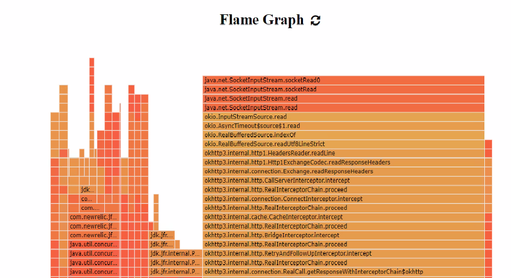
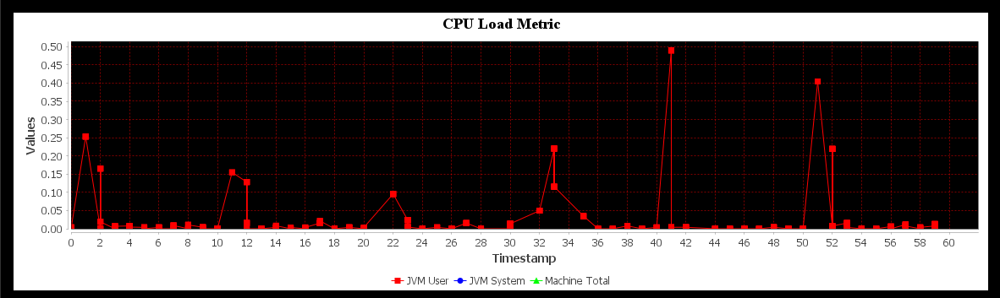
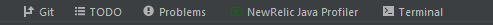
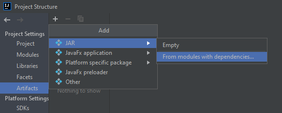
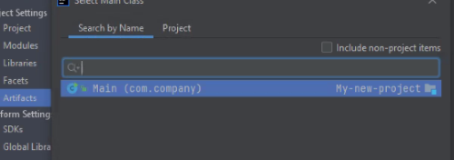
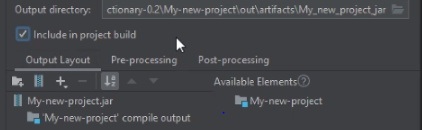
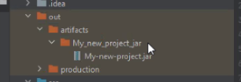

# Java Application Performance Monitoring Plugin for Intellij

[comment]: <> (![Build]&#40;https://github.com/turntabl/intellij-apm-plugin/workflows/Build/badge.svg&#41;)

<!-- Plugin description -->
## Plugin Description
 This is a Java Application Performance Monitoring Plugin for Intellij, that tracks every detail of the JVM (CPU, thread, memory, garbage collection, etc) and also monitors
applications live in production environments.

The Plugin was built using gradle with  [Intellij Platform SDk](https://plugins.jetbrains.com/docs/intellij/welcome.html).

In addition, this plugin uses [NewRelic JFR Daemon](https://github.com/newrelic/newrelic-jfr-core) to do the application profiling.

<!-- Plugin description end -->

## Features
### Metrics
With the New Relic's real-time profiling for Java using Java Flight Recorder (JFR) metrics, you can run steadily, always-on profiling of your Java code in production environments.
This Plugin uses NewRelic JFR Daemon gain insight into the JVM and its operations, 
such as analysis from the ThreadLocal Allocation Buffer (TLAB) that can pinpoint which threads are allocating which object types. 
This can often be used in connection with garbage collection analysis to reveal not only what is being thrown away, but also where it is coming from.
Click on the link for more details[New Relic Docs ](https://docs.newrelic.com/docs/agents/java-agent/features/real-time-profiling-java-using-jfr-metrics/)

 #### -And which include the following metrics: 
      - Flight Recorder
      - Java Application
      - Java Virtual Machine
      - Operating System

### Events
The JFR daemon serves as a transporter for JFR events and allows you to control
the ability of the New Relic One platform for visualizing your JVM's behavior.

 #### -And it includes the following events:
      - JVM Information
      - JFR Compilation
      - JFR Method Sample
      - Java Monitor wait
      
### Graphs & Charts
#### Flame Graph

#### CPU Load Metric

## Installation
  ### Procedure To install Plugin from Disk
[comment]: <> (  <kbd>Install Plugin</kbd>)
[comment]: <> (- Using IDE built-in plugin system:)
[comment]: <> (<kbd>File from the Toolbar or Menu Bar</kbd> > <kbd>Settings/Plugins</kbd> )

[comment]: <> (  <kbd>select from the pop up menu</kbd> > <kbd>Install Plugin from Disk</kbd>)

[comment]: <> (  <kbd>Settings/Preferences</kbd> > <kbd>Plugins</kbd> > <kbd>Marketplace</kbd> > <kbd>Search for "intellij-plugin"</kbd> >)

- Manually:

  Download the [latest release](https://github.com/turntabl/intellij-apm-plugin/releases/latest) and install it manually using
  <kbd>Settings/Preferences</kbd> > <kbd>Plugins</kbd> > <kbd>⚙️</kbd> > <kbd>Install plugin from disk...</kbd>

  
  #### Installing Plugin from Disk  
  
  
- A preview of the NewRelic Profiler will show on the right side, then you click apply and okay.
  Afterwards the NewRelic profiler window will be seen at the lower toolbar as displayed below.

  

## Required IntelliJ Setup
 ### Building Your Own Artifact.
- Steps To Follow
  - Go to:  <kbd>File </kbd> > <kbd>Project Structure </kbd>
  - Select <kbd>Artifacts</kbd> > <kbd>+</kbd> > <kbd>Jar</kbd> > <kbd>From Modules With dependencies</kbd>

    
  - Choose the main class and click on okay.
    
    
  - Ensure to check the "Include in project build", afterwards click on apply and okay.
    
         
  - Go to: <kbd>Build Menu</kbd> > <kbd>Build Artifacts...</kbd> > <kbd>Select your application jar</kbd> > <kbd>Build</kbd>
  - After building the project's jar will be generated into the directory `out > artifacts` as shown in the image below
    
    
  
  #### Notice
  - Ensure that the name of the jar generated and its directory have the same name as the name of your application as shown in the image above.
  
## To Run with profiler
#### Notice
  - Before you run your application with profiler, open the tool window at the status bar to activate our web server.
#### Steps to follow
  - To Run with profiler: Goto <kbd>Run</kbd> > <kbd>Run with NewRelic Profiler</kbd>
  - A pop will appear which will require that you set your main class as depicted in the image below.
    
    
  - Click on Run
  ##### Caution: 
      - Ensure you stop NewRelic profiler from running when you are done profiling your application in order to avoid getting full heap error or warnings.
      - Do not tamper with the Vm options and Environment variables unless you know what you are doing.

  ## Images of How to Run your application with Profiler
### Setting your main class in the first image below

  
## Usage 
  

[comment]: <> (  - Goto <kbd>Run</kbd> > <kbd>Edit Configurations</kbd>)

[comment]: <> (  - In the pop up window, click on create new application)

[comment]: <> (  - Choose a name, Run on > Local Machine)

[comment]: <> (  - For the VM Options, enter this command  `-javaagent:./lib/jfr-daemon-1.2.0-SNAPSHOT.jar -jar ./lib/testProject.jar`)
  
[comment]: <> (### Working with different types of projects  )

[comment]: <> (- Pure Java Project)

[comment]: <> (    - Build project first)

[comment]: <> (    - Run the project default main first before you run with the plugin.)

[comment]: <> (- Gradle Projects)

[comment]: <> (  - Build project first)

[comment]: <> (  - Run the project default main first before you run with the plugin.)

[comment]: <> (  - For cases where a null pointer exception is thrown, kindly run the project default main again before running with profiler.)

[comment]: <> (- Maven Projects)

[comment]: <> (  - Build project first)

[comment]: <> (  - Run the project default main first before you run with the plugin.)

[comment]: <> (  - For cases where a null pointer exception is thrown, kindly run the project default main again before running with profiler.)

## Tools Used
-Libraries Used
  -D3 Library click on the link to read more about it [d3-flame-graph](https://github.com/spiermar/d3-flame-graph)
  - Burn Library click on the provided link for more details about it [burn-library](https://github.com/spiermar/burn)
    -The Burn Library was in GoLang but was converted to Java for the purpose of this plugin.
  -Jfree Chat library is use for one the Metrics Graph in this Plugin [Jfree-chat](https://www.jfree.org/jfreechart/)

