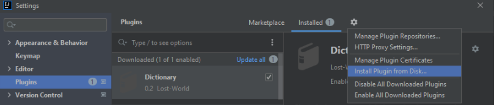

# Java Application Performance Monitoring Plugin for Intellij

[comment]: <> (![Build]&#40;https://github.com/turntabl/intellij-apm-plugin/workflows/Build/badge.svg&#41;)

<!-- Plugin description -->
## Plugin Description
This Java Application Performance Monitoring Plugin for Intellij that tracks every detail of the JVM (CPU, thread, memory, garbage collection, etc) and also monitors
applications live in production environments.

This specific section is a source for the [plugin.xml](/src/main/resources/META-INF/plugin.xml) file which will be extracted by the [Gradle](/build.gradle) during the build process.

To keep everything working, do not remove 
<!-- ... --> sections.
<!-- Plugin description end -->

## Features
#### Metrics
      - Flight Recoder
      - Java Application
      - Java Virtual Machine
      - Operating System
#### Events
      - JVM Information
      - JFR Compilation
      - JFR Method Sample
      - Java Monitor wait
      
#### Flame Graph
      - A flame graph of methods with and without their thread names.
      - CPULoad Graph

### Installation
  ## Procedure To install Plugin from Disk
    -Steps
      -First Go to the Menu bar select<kbd>File from the Menu Bar</kbd> > <kbd>Settings/Plugins</kbd> > 
      -Click on the settings Icon<kbd>select from the pop up menu</kbd> > <kbd>Install Plugin from Disk</kbd> 
      - You will see a Preveiw of the Plugin
      - Click on Apply and Okay which verifies it been applied.
  ## The Images of how to Install from Disk
    -
    

[comment]: <> (- Using IDE built-in plugin system:)

[comment]: <> (  <kbd>Settings/Preferences</kbd> > <kbd>Plugins</kbd> > <kbd>Marketplace</kbd> > <kbd>Search for "intellij-plugin"</kbd> >)

[comment]: <> (  <kbd>Install Plugin</kbd>)

- Manually:

  Download the [latest release](https://github.com/turntabl/intellij-apm-plugin/releases/latest) and install it manually using
  <kbd>Settings/Preferences</kbd> > <kbd>Plugins</kbd> > <kbd>⚙️</kbd> > <kbd>Install plugin from disk...</kbd>
## Usage

### Required IntelliJ Configuration
- Steps to follow
  - Build the project artifact first. The project's jar will be generated
  - The jar generated will be located in this directory (`out > artifacts`)
  - Run the project default main first before you run with the profiler.
  - To Run with profiler: Goto <kbd>Run</kbd> > <kbd>Run with NewRelic Profiler</kbd>
  - Caution: Ensure you stop NewRelic profiler from running when you are done profiling your application
  

[comment]: <> (  - Goto <kbd>Run</kbd> > <kbd>Edit Configurations</kbd>)

[comment]: <> (  - In the pop up window, click on create new application)

[comment]: <> (  - Choose a name, Run on > Local Machine)

[comment]: <> (  - For the VM Options, enter this command  `-javaagent:./lib/jfr-daemon-1.2.0-SNAPSHOT.jar -jar ./lib/testProject.jar`)
  
[comment]: <> (### Working with different types of projects  )

[comment]: <> (- Pure Java Project)

[comment]: <> (    - Build project first)

[comment]: <> (    - Run the project default main first before you run with the plugin.)

[comment]: <> (- Gradle Projects)

[comment]: <> (  - Build project first)

[comment]: <> (  - Run the project default main first before you run with the plugin.)

[comment]: <> (  - For cases where a null pointer exception is thrown, kindly run the project default main again before running with profiler.)

[comment]: <> (- Maven Projects)

[comment]: <> (  - Build project first)

[comment]: <> (  - Run the project default main first before you run with the plugin.)

[comment]: <> (  - For cases where a null pointer exception is thrown, kindly run the project default main again before running with profiler.)

### Tools Used
-Libraries Used
  -D3 Library click on the link to read more about it[d3-flame-graph](https://github.com/spiermar/d3-flame-graph)
  - Burn Library click on the provided link for more details about it [burn-library](https://github.com/spiermar/burn)
    -The Burn Library was in GoLang but was converted to Java for the purpose of this plugin.
  -Jfree Chat library is use for one the Metrics Graph in this Plugin[Jfree-chat](https://www.jfree.org/jfreechart/)
