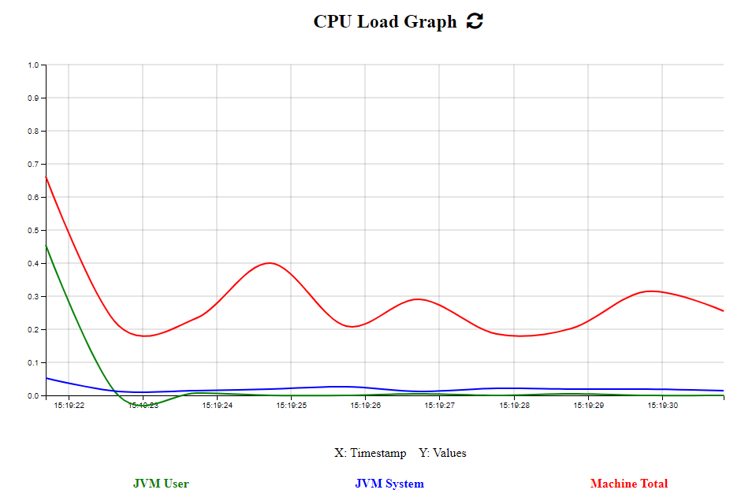

# Java Application Performance Monitoring Plugin for Intellij

[comment]: <> (![Build]&#40;https://github.com/turntabl/intellij-apm-plugin/workflows/Build/badge.svg&#41;)

<!-- Plugin description -->
## Plugin Description
 This is a Java Application Performance Monitoring Plugin for Intellij, that tracks every detail of the JVM (CPU, thread, memory, garbage collection, etc) and also monitors
applications live in production environments.

The Plugin was built using gradle with the  [Intellij Platform SDk](https://plugins.jetbrains.com/docs/intellij/welcome.html).

In addition, this plugin uses the [NewRelic JFR Daemon](https://github.com/newrelic/newrelic-jfr-core) to do the application profiling. You can also find more information about NewRelic profiling [here](https://docs.newrelic.com/docs/agents/java-agent/features/real-time-profiling-java-using-jfr-metrics/).

<!-- Plugin description end -->

## Features
### Metrics
With the New Relic's real-time profiling for Java using Java Flight Recorder (JFR) metrics, you can run steadily, always-on profiling of your Java code in production environments.
This Plugin uses NewRelic JFR Daemon gain insight into the JVM and its operations,
such as analysis from the ThreadLocal Allocation Buffer (TLAB) that can pinpoint which threads are allocating which object types. 
This can often be used in connection with garbage collection analysis to reveal not only what is being thrown away, but also where it is coming from.

 #### It includes the following metrics: 
      - Flight Recorder
      - Java Application
      - Java Virtual Machine
      - Operating System

### Events
The JFR daemon serves as a transporter for JFR events and allows you to control
the ability of the New Relic One platform for visualizing your JVM's behavior.

 #### It includes the following events:
      - JVM Information
      - JFR Compilation
      - JFR Method Sample
      - Java Monitor Wait
      
### Graphs & Charts
#### Flame Graph

#### CPU Load Metric

## Installation
  ### Procedure To install Plugin from Disk

- Manually:

  Download the [latest release](https://github.com/turntabl/intellij-apm-plugin/releases/latest) and install it manually using
  <kbd>Settings/Preferences</kbd> > <kbd>Plugins</kbd> > <kbd>⚙️</kbd> > <kbd>Install plugin from disk...</kbd>

  
  #### Installing Plugin from Disk  
  

- Navigate to the downloaded jar from the previous step and click on OK
  
- A preview of the NewRelic Profiler will show on the right side, then you click Apply and OK.
  Afterwards the NewRelic profiler window will be seen at the lower toolbar as displayed below.

  

## Required IntelliJ Setup
 ### Building Your Own Artifact.
- Steps To Follow
  - Go to:  <kbd>File </kbd> > <kbd>Project Structure </kbd>
  - Select <kbd>Artifacts</kbd> > <kbd>+</kbd> > <kbd>Jar</kbd> > <kbd>From Modules With dependencies</kbd>

    
  - Choose the main class and click on OK.
    
    
  - Ensure to check the "Include in project build", afterwards click on Apply and OK.
    
         
  - Go to: <kbd>Build Menu</kbd> > <kbd>Build Artifacts...</kbd> > <kbd>Select your application jar</kbd> > <kbd>Build</kbd>
  - After building, the project's jar will be generated into the directory `out > artifacts` as shown in the image below
    
    
  
  #### Notice
  - Ensure that the name of the jar generated and its directory have the same name as the name of your application as shown in the image above.
  
## To Run with profiler
#### Notice
  - Before you run your application with the profiler, open the New Relic Java Profiler tool window to activate its local server. Only open the tool window in the project you wish to profile.
  - Profiling can be done multiple times on the same project once the server is still active.  
  - After profiling, close the project window entirely to deactivate the local server. 
  - The same process can be repeated for another project.
#### Steps to follow
  - To Run with profiler: Goto <kbd>Run</kbd> > <kbd>Run with NewRelic Profiler</kbd>
  - A pop-up will appear which will require that you set your main class as depicted in the image below.
    
    
    
  - For gradle projects, the module has to be set to the location of the main class before the main class can be found and set. For example in the image below, the main class (GradleSpringTestProjectApplication) is located in the "main" module before the project's root module. Therefore, the module will be set to the option highlighted below.
    
  - Click on Run
  - Subsequently, the NewRelic run configuration will be saved and added to the run configuration list
  - The results below indicates that your application is about to be profiled
    
  - You can then view the data in the tool window
  ##### Caution: 
      - Do not tamper with the Vm options and Environment variables unless you know what you are doing.
      - Ensure you stop NewRelic profiler from running when you are done profiling your application in order to avoid getting full heap error or warnings.

## Other Tools Used
  - Spiermar's [D3.js Flame Graph Library](https://github.com/spiermar/d3-flame-graph) was used to develop the flame graph 
  - Spiermar's [Burn Library](https://github.com/spiermar/burn) was used to help convert the profiled data into the required format needed for the flame graph. The Burn Library is originally in GoLang and aspects of it was converted to Java for the purpose of this plugin.
  - [Jfree Chat library](https://www.jfree.org/jfreechart/) for the CPU Load graph 

